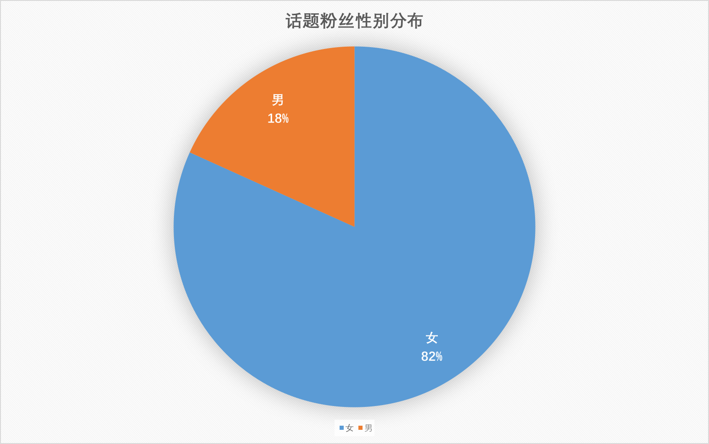
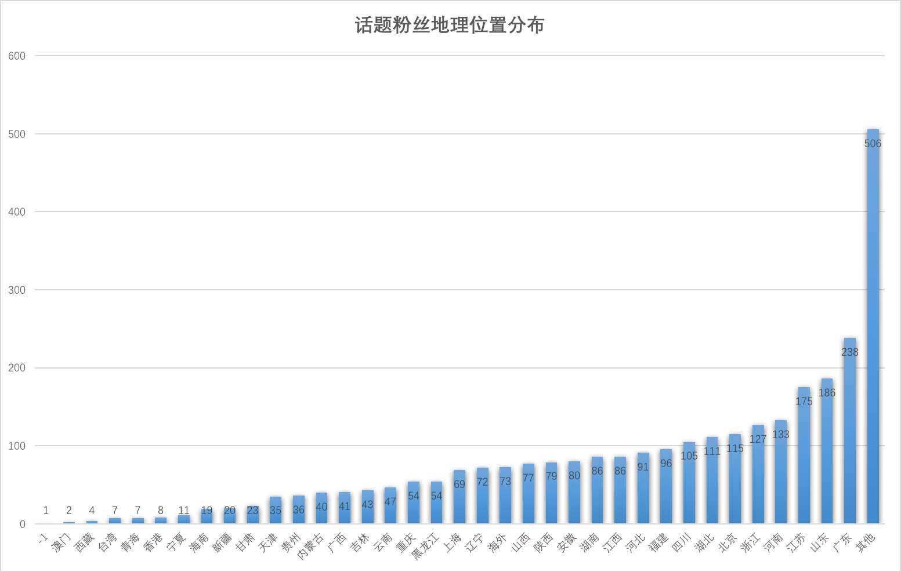
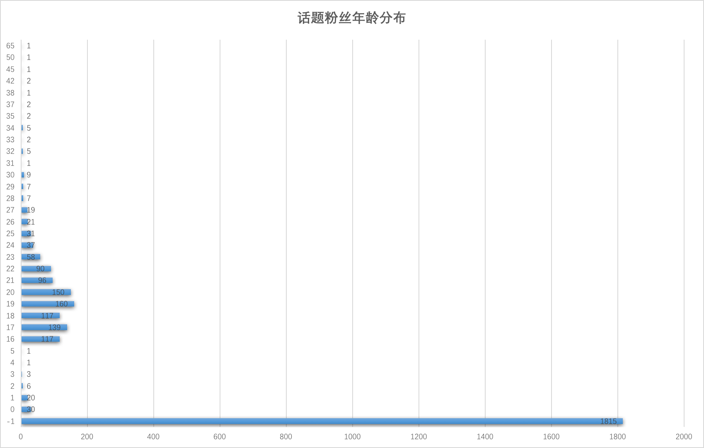
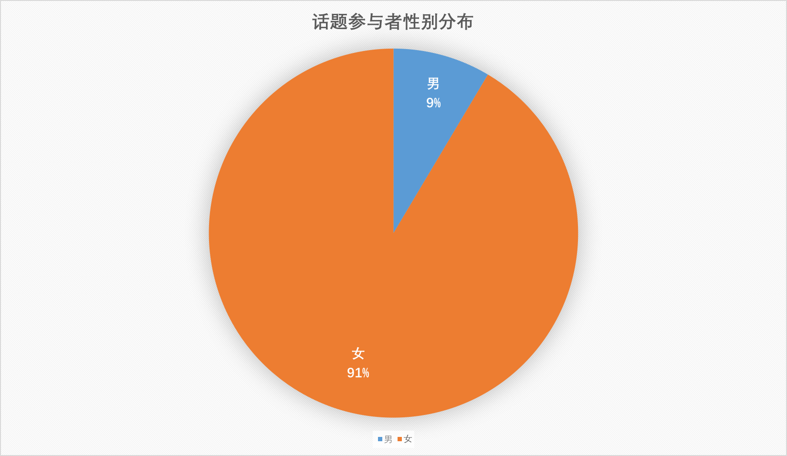
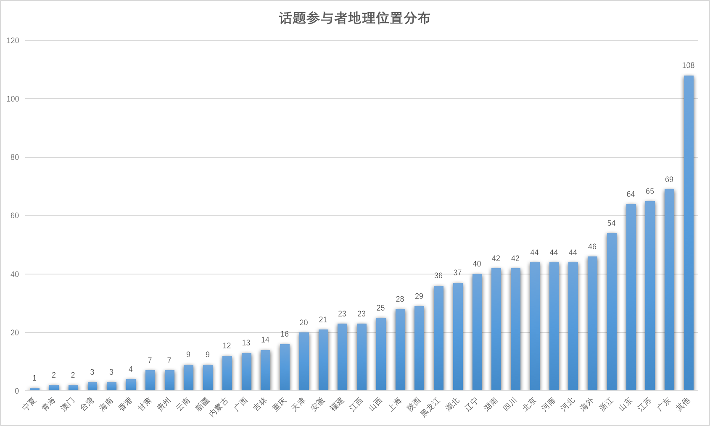
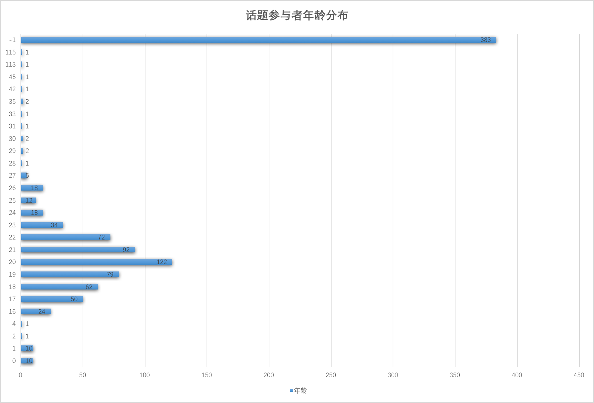
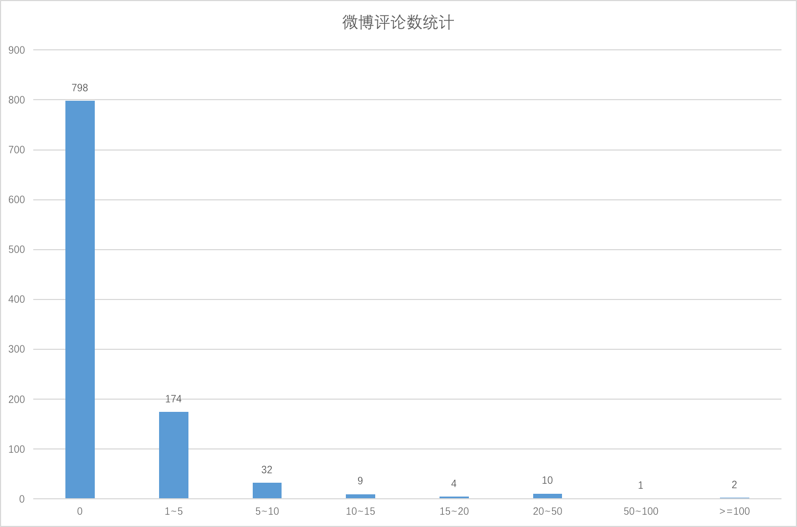
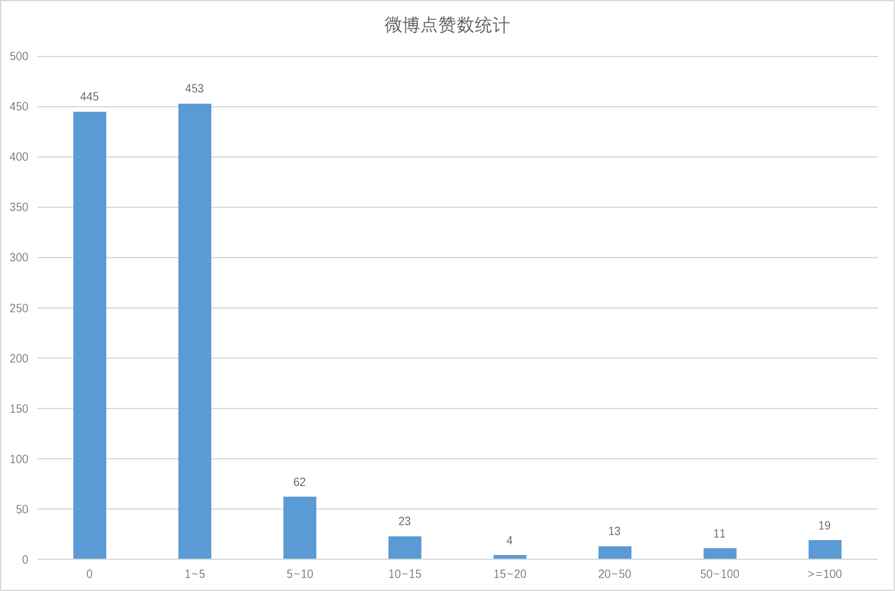
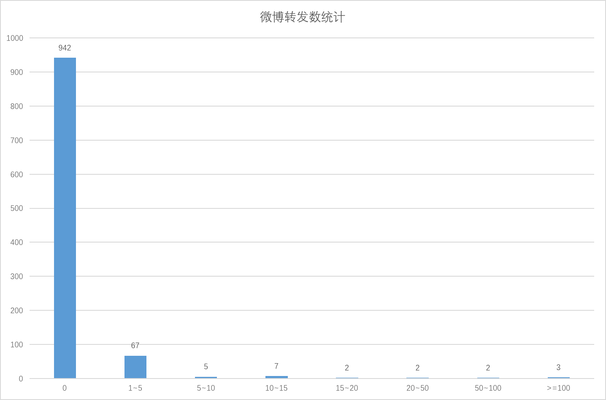
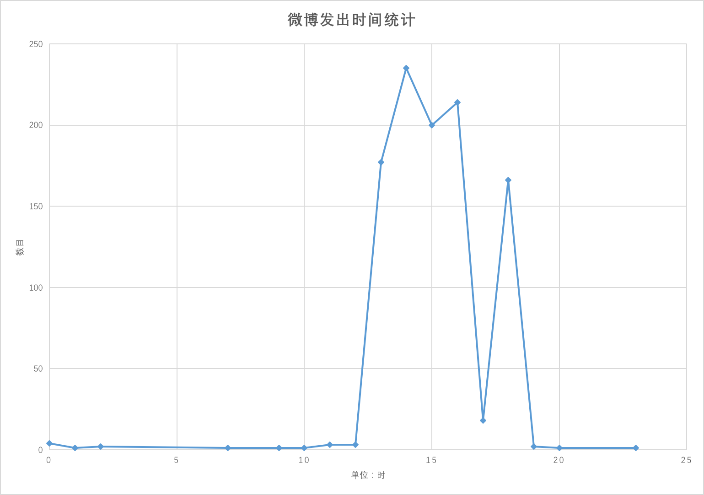

# 实验背景

新浪微博（Weibo/Sina Weibo，官方名称为微博），是一个由新浪网推出， 提供微博客的服务网站。新浪微博是一个类似于Twitter和Facebook的混合体， 用户可以通过网页、WAP 页面、外部程序和手机短信、彩信等发布 140 汉字（280 字符）以内的信息，并可上传图片和链接视频，实现即时分享。新浪微博可以直 接在一条微博下面附加评论，也可以直接在一条微博里面发送图片、视频，新浪 微博最先添加这两点功能。新浪微博是一个基于用户关系的信息分享、传播以及 获取信息的平台，它占据中国微博用户总量的 57%，以及中国微博活动总量的 87%，是中国大陆访问量最大的网站之一。

在新浪微博中，每天都有许多热门话题引发微博用户的广泛讨论。分析这些热门话题的特征（如粉丝的地理、年龄、性别分布，粉丝间组成的社交网络等），对于发现新浪微博中 有相似兴趣的用户群体，理解信息在社交网络中传播的行为有重要意义。

一般有两种获取新浪微博平台数据的方式：第一种方法是编写网络爬虫程序模拟浏览网页的过程，获取HTML/SHTML 数据后进行网页解析获取所需要的信息；第二种方法是通过 API的方式获取数据。在本学期中，我们已经用第二种方法做了微博数据抓取与分析实验，但这种方法的缺点是限制过多，比如最多只能查看一个用户的最新五条微博，30%的粉丝数或关注数等。本次实验我们采用第一种方法，编写python爬虫程序抓取微博和粉丝数据，分析热门话题#最好的我们#的特征。

# 原理及方案设计

要抓取微博上的数据，我们有两种办法：调用微博官方提供的 API，或者实现一个网络爬虫，爬取并分析网页上的内容。由于微博 API 的限制较多（例如无法获取全部关注列表，粉丝列表等等），我们选择实现一个网络爬虫来进行我们的实验。

我们选择使用 Python 3 来编写我们的爬虫程序。网络爬虫需要实现两个功能：模仿浏览器从网页中抓取网页，和从抓取到的网页中提取信息。对于前者，我们使用 Requests 库来进行网页的抓取。对于后者，我们使用 Beautiful Soup 4 库来进行 HTML 的解析。

对于抓取网页的工作，我们决定从多个层面上伪装成普通用户。首先我们模拟用户使用的浏览器的行为。这里我们使用了 iOS 设备上的 `User-Agent` 字段，从而模仿成在 iOS 上通过 Safari 访问网页的用户。具体字段值如下：

    'Mozilla/5.0 (iPhone; CPU iPhone OS 9_3 like Mac OS X)
    AppleWebKit/601.1.46(KHTML, like Gecko) Version/9.0
    Mobile/13E188a Safari/601.1'

我们在每次 GET 和 POST 时都加上这个 `User-Agent` 字段，便可以在一定程度上实现伪装。

同时，我们还需要模拟用户的行为，以防止我们的抓取被监测为脚本行为而被封号。我们从以下几个层面入手：

1. 单个 IP 上同一时间只有 1 个用户访问。
2. 同一用户的多次访问之间有 5s 间隔。
3. 同一用户在访问一定页面后会停止访问。

总的来说，我们通过限制访问微博的频次来模拟真实用户的行为。然而这会导致抓取效率大幅降低。为此，我们在 Digitial Ocean 上租了 25 个 VPS（5个位于纽约，20个位于旧金山），加上助教借给我们的 5 台机器，我们一共拥有了 30 台 VPS。由于每台 VPS 都具有独立 IP，我们便可以降低 IP 被封的风险。

同时，为了模拟真实用户不会一次访问太多页面的特点，我们在淘宝网上购买了 240 个账号，用来轮流使用。我们在实验也确实发现，使用同一账号访问过多页面后，对该页面的后续访问都会被重定向到手机微博首页。因此，我们在脚本中设置了一个页面数上限，在达到访问页面上限后自动切换到下一个账号。

考虑到一些用户的粉丝数目大的惊人（十万/百万级别），我们不可能将其全部抓取下来；而大部分用户的关注人数都十分有限，基本上集中在上百个这样的数量级。因此，我们选择只抓取用户的关注列表，而不抓取粉丝列表。需要注意到，由于我们研究的是特定人群中的社交网络，这样做是没有损失任何信息的。

我们的分工如下：

- 徐孟莹：实现抓取最新微博，抓取话题关注者模块，进行网络结构分析。
- 陈馨瑶：实现抓取个人关注列表模块，进行用户/微博分析。
- 李思涵：实现登录，抓取用户模块，进行网络群体结构分析。

# 实验步骤

## 登陆

为了自动化地抓取微博，我们首先需要模拟网页登录的流程。当然，我们可以在浏览器中登陆后，将 Cookie 手动输入给爬虫。但这样不仅很繁琐，还无法完成大批量自动化登录。所以，我们首先需要实现模拟登录。

首先，我们选择使用 Requests 库中的 Session 对象来进行 GET 和 POST。这是因为 Session 对象会自动保存访问过程中返回的 Cookie，这样我们只要使用一个 Session 对象进行登录，便可以使用这个对象进行后续的访问操作了。

登录一般都包含一个 HTTP POST 操作，用来将账号和密码提交给服务器。手机微博网页版的登录也不例外。需要注意的是，在实验中我们发现，我们的 POST 请求必须要包含 `Referer` 字段，不然会被拒绝登录。最后我们使用的代码如下：

```python
payload = {
    'username': username,
    'password': password,
    'savestate': 1,
    'ec': 0,
    'pageerfer': 'https://passport.weibo.cn/signin/welcome?...',
    'entry': 'mweibo'
}
headers = {
    'Referer': 'https://passport.weibo.cn/signin/',
}
r = self.post('https://passport.weibo.cn/sso/login',
              data=payload, headers=headers)
r.raise_for_status()
```

但到这里还没有完。我们还需要从返回的数据中获取一个叫 `loginresulturl` 的字段，并对其进行访问。这是因为访问 `passport.weibo.cn` 只能让我们获取到该网址下的 Cookie，而我们真实想要访问的是 `m.weibo.cn`。为了获取跨域 Cookie，微博会返还给我们一个 URL，该 URL 会在多个域名间跳转，最终使我们获得多个域名下的 Cookie。具体代码如下：

```python
data = json.loads(r.content.decode())
if data['retcode'] != 20000000:
    raise RuntimeError('Failed to login: ' + data['msg'])

self.uid = data['data']['uid']
logging.info('Logged in, uid: %s', self.uid)

# Get cross-domain cookies.
self.get(data['data']['loginresulturl']);
```

这样，我们便可以获得一个包含了足够 Cookie 的 Session 对象。在随后的访问中，我们可以通过它来进行 GET, POST 等操作，Requests 库会自动为我们的请求加上 Cookie。

## 抓取最新微博

在浏览器中右键点击审查元素可以查看获取最新微博时给网页发送的http请求，例如：

    http://m.weibo.cn/page/pageJson?containerid=100808b9d850fdfb8a
    16743dc597a19fb9daab&containerid=100808b9d850fdfb8a16743dc597a
    19fb9daab&luicode=10000011&lfid=100803&v_p=11&ext=&fid=100808b
    9d850fdfb8a16743dc597a19fb9daab&uicode=10000011&next_cursor=23
    99999990&page=2}

其中 `containerid` 表示话题编号，`page` 表示页编号，一页中约有10条最近微博，`next_cursor`指示下一页开始的位置。于是就可以按照

    'http://m.weibo.cn/page/pageJson?containerid=%s&next_cursor=%s
    &page=%d' % (containerid,next_cursor,i)

的格式发送HTTP请求。这里需要注意的是，每次需要把本次请求返回的 `next_cursor` 填入下一页请求的url地址中，否则可能会出现相邻两页有较多重复微博的情况，导致抓取效率低。

我们还可以看到网页返回的数据格式：


可以看到 `card_group` 下共有10条微博，展开可以看到每一条微博的具体信息。在python中用json解析函数即可得到相应的字典类型的数据，根据需要，我们定义微博类如下：

```python
class Post(object):
    """docstring for Post"""
    def __init__(self, mid, uid, created_at, length, repost_num,
                 comment_num, like_num):
        self.mid = mid
        self.uid = uid
        self.created_at = created_at
        self.length = length
        self.repost_num = repost_num
        self.comment_num = comment_num
        self.like_num = like_num
```

从上往下依次表示一条微博的微博id、用户id、创建时间、微博长度、转发数、评论数和点赞数。这部分代码见`weibo.py`中的`topic_posts`函数。

## 抓取话题关注者

类似3.2节，抓取话题关注者发送的HTTP请求url为


    'http://m.weibo.cn/page/pageJson?&containerid=230403_-_%s&page=%d'
     % (containerid, i)

这里只将用户id抓取下来，对应的用户具体信息抓取在下一节中分析。这部分代码见`weibo.py`中的`topic_followers`函数。

## 抓取个人关注列表

抓取个人关注列表的函数接口如下：

```python
def followings(self, uid):
```

其中，uid是需要抓取的用户的uid，函数的返回值是该用户关注的人的uid。

抓取过程如下：

利用GET请求访问以下网址

```python
r = self.get('http://m.weibo.cn/page/json?containerid=100505%s_-_\FOLLOWERS&page=%d'
             % (uid, i))
```

通过控制page的值就可以达到访问关注列表的不同页的目的。

解析所获得的数据结构，关注人的信息存储在`['cards'][0]['cards_group']`下，进一步，可以从`['user']['id']`中得到关注人的uid。

进一步，为了应对经常性的抓取不成功和存在限制的情况，引入try结构，若三次抓取不成功则退出函数。


## 抓取用户信息

我们如此定义我们的 User 类型：

```python
class User(object):
    """docstring for User"""
    def __init__(self, uid, gender, age, location, post_num, following_num,
                 follower_num, following_uids):
        self.uid = uid
        self.gender = gender
        self.age = age
        self.location = location
        self.post_num = post_num
        self.following_num = following_num
        self.follower_num = follower_num
        self.following_uids = following_uids
```

与其它信息不同，微博用户的个人信息没有以 JSON 格式数据的形式呈现给我们（需要注意微博的发布人等字段中存在一部分个人信息，但这里的个人信息不全，例如没有该用户的年龄）。为了抓取用户的个人信息，我们需要访问如下两个网址：`/u/<uid>` 和 `/users/<uid>`。其中前者包含用户的微博数，关注数和粉丝数，后者则包含了该用户的性别，所在地和生日（用于计算年龄）。

前者的数据出现在网页中的 Javascript 代码里，解析起来较为麻烦。所以我们使用了样例代码中的解析方法，从字符串中直接找到对应的数据段，将其解析为 JSON。这样做可行是因为 JSON 使用的正是 Javascript 的数据表示方式。

对于后者，我们使用 CSS Selector 对其进行解析，提取出我们感兴趣的字段。需要注意的是，这里很多字段并没有严格的格式要求，有些人在“生日”字段中填写的甚至是星座信息。因此我们先尝试对每个字段进行解析，在失败时将该字段设为 None。具体代码见 `weibo.py` 中的 `Weibo.user` 函数。

## 用户信息统计

用户信息统计主要统计了话题关注者和话题参与者各自的年龄分布、性别分布和地理位置分布。除此以外，我还统计了抓下来的微博的转发数、评论数、点赞数分布和微博的发送时间分布（精确到小时），具体的步骤如下：

首先读取文件，关注者的信息存储在followers.pickle中，以用户的ID作为字典的键值。话题参与者的信息存储在data.pickle的`data['topic_participants']`中，他们发送的微博的信息则存储在`data['topic_posts']`中。在统计话题参与者和关注者的信息时，采用的数据结构如下：

```python
count = {
      'location': {},
      'age': {},
      'gender': {}
}
```

在统计话题微博的信息时，采用的数据结构如下：

```python
count = {
      'repost_num': {'0': 0, '1~5': 0, '5~10': 0, '10~15': 0,
                     '15~20': 0, '20~50': 0, '50~100': 0, '>=100': 0},
      'comment_num': {'0': 0, '1~5': 0, '5~10': 0, '10~15': 0, '15~20': 0,
                      '20~50': 0, '50~100': 0, '>=100': 0},
      'like_num': {'0': 0, '1~5': 0, '5~10': 0, '10~15': 0, '15~20': 0,
                   '20~50': 0, '50~100': 0, '>=100': 0},
      'day': {},
      'hour': {}
}
```

在读取数据时，以用户信息统计为例，首先根据其数据结构得到每个人的地理位置、年龄和性别信息，以该信息作为键值，在count中判断该键是否存在。如果不存在，则新设置该键并将对应的值置为1，如果存在，则在原始值的基础上累加。在进行微博相关信息的统计时则采用了区间判断的方式，并对发送时间进行分割，提取出小时数。将最后统计得到的结果输入一个csv文件，便于用Excel进行作图。


## 社交网络分析

根据每个用户的关注者信息，建立邻接矩阵：

$$
A[i][j] = \begin{cases}
1,& \text{用户$i$关注了用户$j$}\\
0,& \text{用户$i$没有关注用户$j$}
\end{cases}
$$

由此可以方便地计算出，在分析的所有用户范围内，每个用户的关注数（出度）$\text{following}[i] = \sum{A[i][:]}$和被关注数（入度）$\text{follower}[i] = \sum{A[:][i]}$。

若$A^k[i][j]>0$，则表示用户$i$可以经过$k$跳到达用户$j$，因此可以迭代计算$A^k = A^{k-1}\cdot A$直到收敛，最后大于0的元素对应的两个用户在同一孤岛，据此可以算出孤岛个数、每个孤岛的用户数目分布。

最后，为了得到社交网络中各个节点的出入度分布，我们只需要将临接矩阵进行行求和/列求和，便可以得到每个用户的出度/入度。

# 结果

## 用户/微博分析

需要说明的是，我们所抓取的热门话题为“最好的我们”，这是一部青春校园爱情网剧。此外，在统计中出现的“-1”，指的是该用户并未设置这一信息或设置的该信息为空。

### 话题关注者

话题关注者的信息存储在`followers.pickle`中，编写程序对其进行分类和计数。其中，用户的地理位置信息只统计了省份的分布，作出的分布图如下：



可以看到，该话题的关注者中，女性的比例要远远大于男性，这和这部剧的定位也是较为一致的。



在用户的地理位置分布中，占比最高的是“其他”，即这部分用户并未透露自己的地理位置信息，根据我对微博的了解，设置为其他的常常有如下几种情况：

- 不愿意透露自己的个人信息
- 一些营销号性质的账户或僵尸粉

由此也不难解释为何“其他”会占如此大的比重。

在剩余的分布中，根据趋势，我认为各省市的人数分布和其经济状况以及人口数目呈正相关的关系。



年龄分布中同样存在着很多无效年龄。在排除掉这些无效年龄后我们可以发现，大多数的关注者的年龄都集中在 16-22 岁之间，并随着年龄的增大缓慢减少。其中，16岁正好是一般高中生的入学年龄，而这部电视剧讲诉的正是高中生活，所以没有抓到更低年龄的关注者也是很正常的一件事情。

需要注意的是，虽然高年龄关注者较少，但仍存在。这说明还是有部分中年人对该电视剧感兴趣，这说明这类青春偶像剧的主要观众是高中生，大学生，但对中年观众仍有一定吸引力。

### 话题讨论者

话题讨论者的信息存储在`data.pickle`中，作出的分布图如下：



可以看到，话题讨论者中女性的比例仍然是要远大于男性的，但其比例比话题关注者中的更多。这说明女性观众更倾向于发和该剧有关的微博，而男性观众更倾向于观看而不讨论。




在用户的地理位置分布与话题关注者的基本一致，再次不再次分析。



可以看到，话题讨论者的年龄仍然主要集中在 16-22 岁之间，但大部分讨论者都在 20 岁上下。这可能是因为大学生更加热衷于在各种社交媒体上对这类话题进行讨论，其他年龄段讨论相对较少的原因可能有很多，一个原因是高中生由于课业压力较大，手机管控较严等，更高年龄段的人面临工作的压力。相比之下只有大学生既有充足的时间，又有较为充沛的精力。

### 微博信息统计



可以看到，大部份的微博是没有任何评论的。绝大部份的微博频率数都小于15。这说明微博上的讨论大多还是集中在特定的大V用户下，大部分用户的微博评论区内实际上空空如也。



与评论数不同，微博点赞数显得更加平缓，大部分微博都拥有一些点赞。同时需要注意的是，有不少微博的点赞数超过20。前者是因为微博上有很多用户更倾向于点赞而不是评论，后者是因为大V用户的微博往往一出场就可以获得很多点赞。



微博转发数的趋势和微博评论数基本一致，在这里不重复分析。



从图中可以看出，我们大图分的微博都是在同一天抓取的，具体来说是在10个小时以内抓取的。因此我们的实验主要体现的是这个时段下的微博情况，对不同时段的情况没有做研究。

## 社交网络分析

我们通过先前处理得到的单向临接矩阵，将三千余名用户的关注关系画出来，如图所示：


可以看到，除去单个用户的孤岛外，我们捕获到的用户中只有10个左右的孤岛。其中，一种孤岛模式是两个人互相关注。这种情况应该是因为二者是熟人，并且共同关注了一个话题。此外还有两个比较小（4个用户）的孤岛结构，这可能有部分随机的因素。最后，最显著的是，位于图像左上角的一个大孤岛。很容易发现，这个孤岛有一个“中心”，并有数以百计的用户关注这个中心节点。然后，这个中心也延伸出了一两个小中心，形成了第二圈，乃至第三圈用户。

其中，入度前十的值为：685, 5, 5, 3, 3, 2, 1, 1, 1, 1。

出度前十的值为：4, 2, 2, 2, 2, 2, 2, 2, 2, 2。

可以看到，较大入度的点极少，而极本没有较大的出度。这是因为少量大V用户能积聚很多粉丝，而大部分人都不会关注过多的用户。

为了更好地分析最大孤岛的情况，我们对抓取到的用户之间的关注关系作了群体分析，提取出入度较大的点和其周围的点作为一个群体，并对其进行染色。最后得到的网络如下：


可以看到，大部分的微博用户都处在一个孤岛之中。而这个最大的孤岛又大致分为 3 个用户群体，每个用户群体又存在一个核心。其中，最大的群体，也就是图中的红色群体，其核心是 @最好的我们网剧：


可以看到，这是一个有着 28 万粉丝的，《最好的我们》网剧的官方微博。它上面包含了很多《最好的我们》的第一手资料和新闻，不难想象为何如此多的用户都关注了它。其余的两个用户分别是 @tracy许魏洲Zzzzz（3305 粉丝）和 @然韵吧官博（518 粉丝）。他们分别构成了绿色的群体和蓝色的群体。我们把这三个节点在图上用红圈标了出来。

同时，注意到节点2，3又同时关注了节点1。这样便形成了我们刚刚提到的“第二圈用户”，“第三圈用户”。可以看到，尽管这两个小团体主要围绕的是节点2，3，但节点1对其仍然有比较直接的作用。例如，节点1发布了一条新微博，节点2，3对其进行转发，第二圈用户，第三圈用户便可以得知此微博。这也反映了微博中存在的一种现象：有些人并不会直接关注官方微博，而是会关注一些关注官方微博的人，而这些人又会对官方微博发布的微博进行筛选和过滤。这样，“第二圈”，“第三圈”用户获取到的消息就普遍比较少量而有价值了。

# 总结

从这次实验可以看出，参与这个话题的人组成的社交网络存在很多孤岛。我们认为，这是由于微博与人人，校内等网站不同，更多地是以兴趣爱好而不是为现实生活中的人际关系为依托。例如从社交网络中可以看出，在我们选择的话题#最好的我们#下，大部分用户之间并没有存在联系。相反，有很大一部分用户都是孤岛，而也有很大一部分用户关注了同一个大V。这个大V通常来说是官方微博，用于发布该话题的最新情报和消息。也就是说，在同一个话题下，大部分的社交网络关系都是“发布者-接受者”的关系，很难出现比较平等的关系。

同时，要注意到由于话题这种机制的设定，用户并不需要真正关注很多用户，便可以参与一个话题的讨论。这就是为什么我们在实验中抓取到的大多都是单个孤岛。这些用户很有可能在查看“热门话题”的时候关注了这个话题，并参与了这个话题的讨论。但它们并没有达到铁杆粉丝的地步，因此并没有关注官方微博等小团体。所以说，这里形成的用户群体是比较松散的。这实际上是一个好处，它意味着用户可以轻松地在各个热门话题直接进行流动，而不用担心之前的热门话题污染自己的时间线。可以说微博建立的这种社交网络是偏向于快节奏讨论的，是比较适合现在的使用者的。

同时，对用户的分析也让我们发现，话题的热度确实存在着一定的区域性，同时也有其针对的年龄段。在我们的实验中，我们选取到的是一部青春偶像剧，所以其年龄段偏向高中生和大学生。但是不难想象，一些话题（如国家政治）可能会更吸引年龄更大的用户，而一些话题（如游戏）可能会吸引一些低龄用户。同时，性别也是决定性的因素之一。

总的来说，这次实验中我们实现了一个网络爬虫，并抓取了一个话题下的参与者和讨论者。在这种话题中，往往会有一个中心者（通常是大V或官方微博），并有大量的单个“孤岛”，其节点有明显的性别，年龄和地域统计特征。
